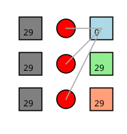
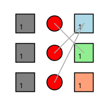
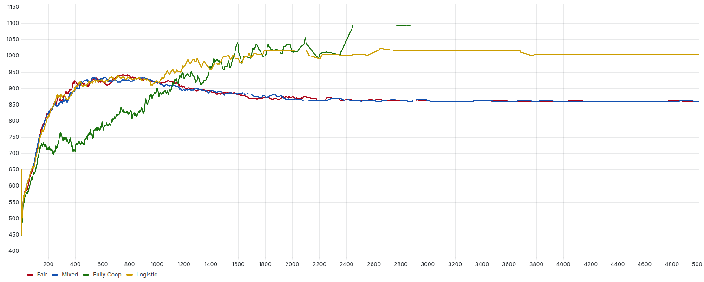
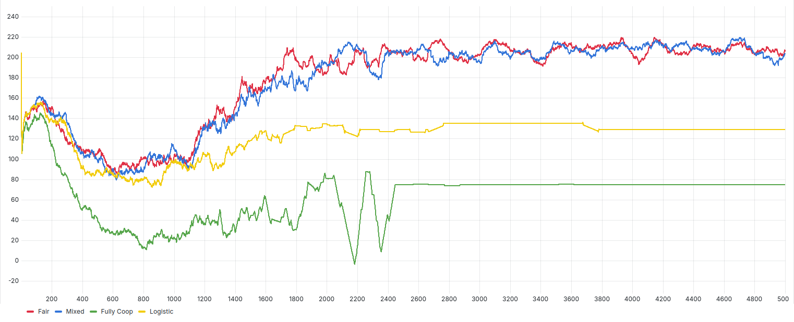
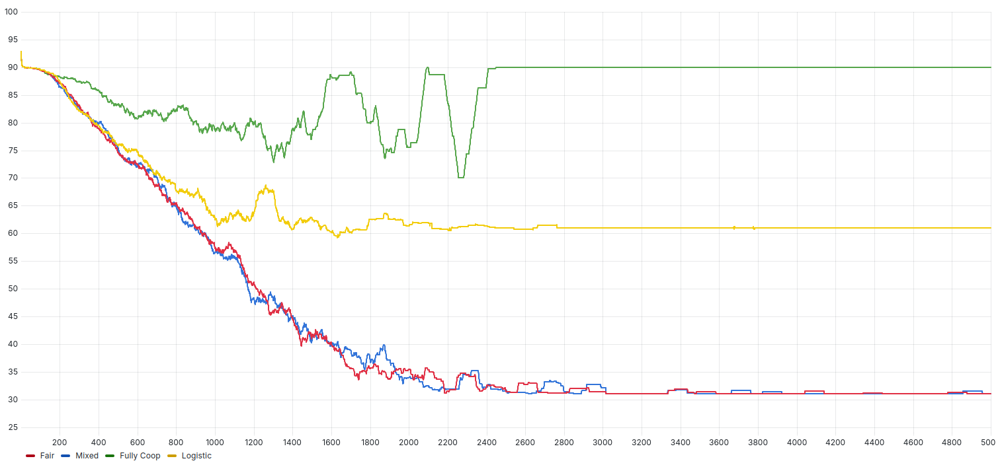

# CollectingResource experiment

## Intro

CollectingResource is an experiment where agents request resources from production units and receive rewards from collection and distance-based penalties. The experiment is defined by its environment, agents, scenarios, reward models, and launchers.

## Simulation loop (scheduler)

SchedulerCollectingResource coordinates the simulation by calling environment and agent methods at the right time, using the base flow provided by MLKScheduler. It is responsible for triggering observation, action, environment reaction, experience collection, model updates, and policy updates.

Simulation stop conditions and timing rules are configured in SchedulerCollectingResource via its internal criteria class (SchedulerTrade2DCriteria).

## Launchers and how to run

All launchers extend LauncherCollectingResource, which defines the environment parameters and starts the simulation. Four concrete launchers are defined, respectively:

- LauncherMixedReward uses MixedReward
- LauncherFullyCooperativeReward uses FullyCooperativeReward
- LauncherFairMixedReward uses FairMixedReward
- LauncherLogisticalReward uses LogisticalRewardModel

The used scenario is defined by each launcher through getScenario().

Each concrete launcher provides a main method, so you can run the class directly in your IDE.

## Results

This experiment illustrates how different reward models affect agent behavior in the same environment and scenario. All results were obtained with independent Q-learning agents without communication. The parameter for the simulation were : episode last 30 timesteps, and the simulation ends after 5000 episodes. More parameters can be seen in the SchedulerCollectingResource for the simulation parameters, and in CollectingResourceAgent for the learning parameters. 

### Final Policies

#### Mixed / Fair Mixed Reward

Mixed and Fair Mixed rewards lead to strongly competitive behavior, with all agents targeting the highest-value production unit.

#### Fully Cooperative Reward

The Fully Cooperative reward encourages agents to distribute themselves across the most valuable production units, reducing competition.

#### Logistical Reward

The Logistical reward produces an intermediate behavior by penalizing requests to overcrowded production units. 2 units compete for 1 resource, while the last one takes another resource.

### Performance Metrics

The following figures compare the four reward models on ScenarioSpatial5.

#### Total Reward

The Fully Cooperative reward achieves the highest final total reward, followed by the Logistical reward. Mixed and Fair Mixed rewards lead to stronger competition and lower overall performance.

#### Lowest Individual Reward

The Fully Cooperative reward produces the lowest outcome for the worst-performing agent because it focuses on collective rather than individual performance.

#### Total Resources Collected

The Fully Cooperative reward leads to the largest number of collected resources by reducing competition. Mixed and Fair Mixed rewards result in stronger competition for high-value resources, while the Logistical reward partially mitigates this effect.