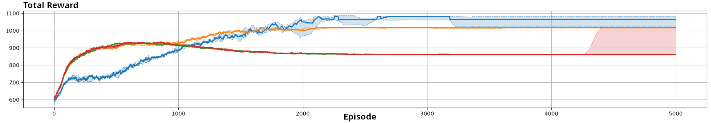
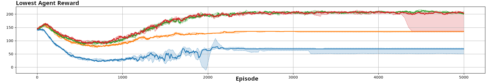
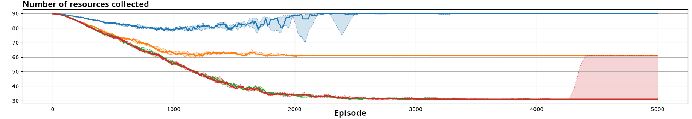

# CollectingResource experiment

## Intro

CollectingResource is an experiment where agents request resources from production units and receive rewards from collection and distance-based penalties. Entities produce resources, and agents can collect one unit of a resource at each timestep from their selected production unit. The experiment is defined by its environment, agents, scenarios, reward models, and launchers.

## Simulation loop (scheduler)

SchedulerCollectingResource coordinates the simulation by calling environment and agent methods at the right time, using the base flow provided by MLKScheduler. It is responsible for triggering observation, action, environment reaction, experience collection, model updates, and policy updates.

Simulation stop conditions and timing rules are configured in SchedulerCollectingResource via its internal criteria class (SchedulerTrade2DCriteria).

## Reward Models

Four different reward models are evaluated. Let $\bar{r}_i$ denote the raw reward of agent $i$, $r_i$ its final reward, and $N$ the number of agents.

### Fully Cooperative Reward

`FullyCooperativeReward` gives all agents the average raw reward:

$$
r_i = \frac{1}{N}\sum_{j=1}^{N}\bar{r}_j.
$$

### Mixed Reward (Independent reward)

`MixedReward` rewards each agent according to its individual outcome:

$$
r_i = \bar{r}_i.
$$

### Fair Mixed Reward

`FairMixedReward` combines each agent's raw reward with the lowest raw reward received by any agent:

$$
r_i = (1-\delta)\bar{r}_i + \delta \min_j \bar{r}_j,
$$

where $\delta \in [0,1]$ is the equity parameter. A larger $\delta$ gives more weight to the lowest individual reward. In the following experiments, $\delta$ is set to $0.5$. The influence of this parameter is discussed at the end.

### Logistical Reward

`LogisticalRewardModel` reduces an agent's raw reward when the requested production unit does not have enough stock to satisfy all requests:

$$
r_i = \bar{r}_i \min(1,\tau_i),
$$

where $\tau_i$ is the ratio between the available stock of the production unit requested by agent $i$ and the total quantity requested from that unit.

### Default event reward value

Reward models manipulate the default event reward $\rho$ to generate the final reward $r$ for each agent. The following list presents the possible events in this experiment and their associated default rewards:

- *Collect Resource*: This event is associated with an agent when it collects a resource. The corresponding reward is $\rho(e_{\text{collect\_resource}}) \in \{0, 3, 5, 30\}$, depending on the resource acquired. The distribution of resource values is highly unequal. Because high-value resources are produced in limited quantities, this creates incentives for increased competition.

- *Distance Penalty*: This event is associated with an agent when it travels to collect a resource. The value of $\rho(e_{\text{distance}})$ is negative and depends on the distance traveled. In this scenario, this penalty cannot be lower than $-1.5$.

## Launchers and how to run

All launchers extend LauncherCollectingResource, which defines the environment parameters and starts the simulation. Four concrete launchers are defined, respectively:

- LauncherMixedReward uses MixedReward
- LauncherFullyCooperativeReward uses FullyCooperativeReward
- LauncherFairMixedReward uses FairMixedReward
- LauncherLogisticalReward uses LogisticalRewardModel

The used scenario is defined by each launcher through getScenario().

Each concrete launcher provides a main method, so you can run the class directly in your IDE.

## Other modules configuration

All components except the reward model are identical across experiments.

For the learning module, the learning algorithm is Q-learning, a value-based algorithm based on a Q-table. For each state-action pair, the table stores a value corresponding to the expected return. The update follows the equation:

$$
Q_{t+1} = Q_t + \alpha \cdot (r_t + \gamma \cdot Q_{\max} - Q_t)
$$

where $Q$ is the table value, $\alpha$ is the learning rate, and $\gamma$ is the discount factor. The value of $\alpha$ is set to $0.2$, and $\gamma$ is set to $0.95$.

The policy is based on the Q-table and selects the action associated with the highest value. The policy is epsilon-greedy, and the $\epsilon$ parameter follows the equation:

$$
\epsilon = (1-d)^t
$$

where $d$ is the decay rate, set to $0.003$, and $t$ is the number of episodes. Thus, the $\epsilon$ parameter decreases exponentially.

Each agent has one policy and one learning algorithm, which are called when required.

Training and execution are completely decentralized (DTE). There is no communication between agents, and agents do not build or use models of other agents.

To evaluate the system, three metrics were selected. The evaluation criteria are the total reward, which indicates whether the system reaches a high collective value; the lowest individual reward, which is used as a fairness indicator; and the total number of collected resources, which is negatively correlated with the competitiveness of the system.

## Results

All the experiments were run with ten different seeds. The curves in the figures represent the median across all runs, while the colored areas indicate the range between the first and third quartiles. The data are smoothed using a moving average with a window size of $100$.

This experiment illustrates how different reward models affect agent behavior in the same environment and scenario. All results were obtained with independent Q-learning agents without communication. The simulation parameters were: each episode lasts 30 timesteps, and the simulation ends after 5000 episodes. More parameters can be seen in the SchedulerCollectingResource for the simulation parameters, and in CollectingResourceAgent for the learning parameters. 

### Final Policies

#### Mixed / Fair Mixed Reward

Mixed and Fair Mixed rewards lead to strongly competitive behavior, with all agents targeting the highest-value production unit.

#### Fully Cooperative Reward

The Fully Cooperative reward encourages agents to distribute themselves across the most valuable production units, reducing competition.

#### Logistical Reward

The Logistical reward produces an intermediate behavior by penalizing requests to overcrowded production units. 2 agents compete for 1 resource, while the last one takes another resource.

### Performance Metrics

The following figures compare the four reward models on ScenarioSpatial5. Each color is associated with a reward model. Green is independent reward, blue is fully cooperative reward, red is fair mixed reward and orange is logistical reward.

#### Total Raw Reward

The Fully Cooperative reward achieves the highest total raw reward, followed by the Logistical reward. Mixed and Fair Mixed rewards lead to stronger competition and lower overall performance.

With the Fully Cooperative model, this metric is precisely what is maximized by all the agents, which is coherent with the observed results.

#### Lowest Individual Raw Reward

The Fully Cooperative reward produces the lowest outcome for the worst-performing agent because it focuses on collective rather than individual performance. With this reward model, all agents learn behaviors that favor collective performance, Therefore, every valuable resource must be collected by an agent, rather than left uncollected, then leading to one agent always collecting the resource associated with the smallest positive reward.

Mixed and Fair Mixed reward models lead to similar results. No agent wants to be left over. Even a small chance of getting the best resources is more profitable (individually speaking). No agent sacrifices itself for the greater good. The lowest individual reward is similar to the highest individual reward, making the result fairer.

With the Logistical reward model, one agent collects the second most valuable resource, while the other two compete for the most valuable one.

#### Total Resources Collected

The Fully Cooperative reward leads to the largest number of collected resources by reducing competition. Mixed and Fair Mixed rewards result in stronger competition for high-value resources, while the Logistical reward partially mitigates this effect.

## Discussion of the Equity Parameter of the FairMixedReward

In this experiment, `FairMixedReward` produces results similar to those obtained with `MixedReward`. The difference between the two models is that `FairMixedReward` penalizes an agent proportionally to the difference between its raw reward and the lowest raw reward among all agents.

However, the behavior emerging with `MixedReward` already tends to balance the agents' rewards. Consequently, adding the equity term does not substantially change the learned behavior.

Increasing $\delta$ nevertheless makes learning more difficult because the final reward becomes less directly correlated with the individual agent's actions. As $\delta$ increases, a larger part of each agent's reward depends on the outcome of the least-rewarded agent.
