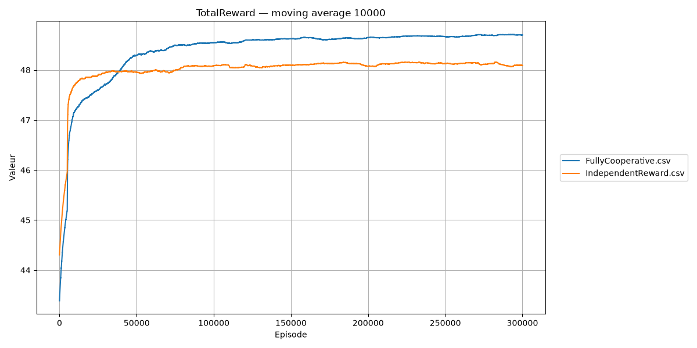
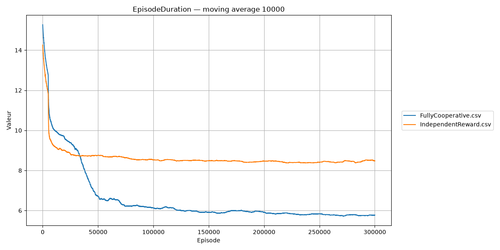
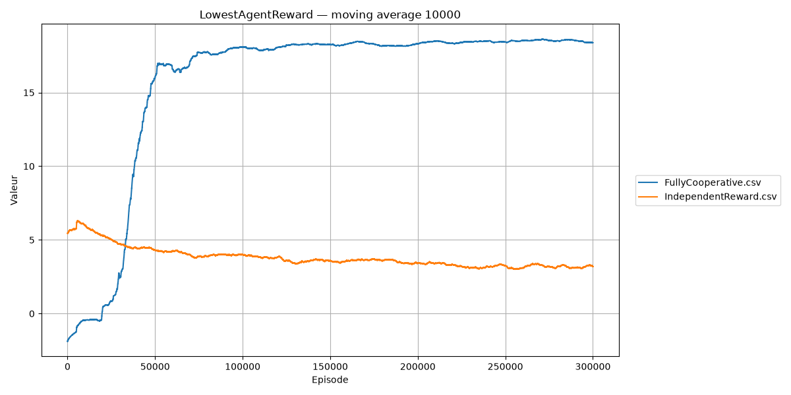

# Foraging Experiment

## Introduction

Foraging is a simple experiment in which agents move through a 2D grid to collect resources. Agents receive rewards for collecting resources and a penalty at each time step until all resources have been collected. An episode ends when all resources have been collected or when the time-step limit is reached.

The following sections describe the experiment conducted with two agents using ScenarioDeterministic1.

## Environment

The experiment takes place in a 5 × 6 grid implemented by EnvForaging. At each time step, agents can move left, right, up, or down.

The positions and properties of the resources are defined by ScenarioDeterministic1.

## Agents and Learning

The experiment uses two independent Q-learning agents without communication. Each agent uses:
- a QValueBasedPolicy;
- an EpsilonGreedyPowerDecay exploration strategy;
- a learning rate of 0.2;
- a discount factor of 0.995.

The agents are implemented by ForagingAgent.

## Simulation Loop

SchedulerForaging coordinates the simulation by triggering agent actions, environment reactions, experience collection, and learning updates.

An episode ends when all resources have been collected or when the maximum duration of 100 time steps has been reached.

## Scenario and Reward Models

Both reward models are evaluated using ScenarioDeterministic1.

### Fully Cooperative Reward

FullyCooperativeReward gives agents a shared reward, encouraging them to maximize collective performance.

Launcher: LauncherForagingFullyCooperative

### Mixed Reward

MixedReward rewards agents according to their individual outcomes, encouraging them to maximize their own performance.

Launcher: LauncherForagingMixedReward

## Evaluation Metrics

The experiment is evaluated at the end of each episode by ForagingEnvEvaluator.
- TotalReward is the sum of the rewards received by all agents during the episode.
- EpisodeDuration is the number of time steps elapsed during the episode.
- LowestAgentReward is the cumulative reward obtained by the worst-performing agent.

## Launchers and How to Run

All concrete launchers extend LauncherForaging, which defines the common environment and agent initialization logic.

The available launchers are:
- LauncherForagingFullyCooperative
- LauncherForagingMixedReward

Each launcher provides a main method and can be run directly from the IDE.

## Results

The following results compare FullyCooperativeReward and MixedReward using ScenarioDeterministic1.

The resulting dynamics depend on the reward model. With the Mixed reward model, one agent rushes toward the resource initially located near the other agent, collects it first, and then collects the resource initially closest to itself. Consequently, one agent collects all the resources while the other collects none.

With the Fully Cooperative reward model, the agents collect different resources rather than competing for the same ones. Both agents therefore contribute to completing the task.

### Total Reward

The Fully Cooperative reward model produces the highest total reward.

### Episode Duration

With the Fully Cooperative reward model, agents learn to collect all resources in fewer time steps.

### Lowest Agent Reward

The Mixed reward model leads to a more unbalanced outcome, as one agent collects all the resources while the other receives only time-step penalties. The Fully Cooperative reward model produces a better outcome for the worst-performing agent.