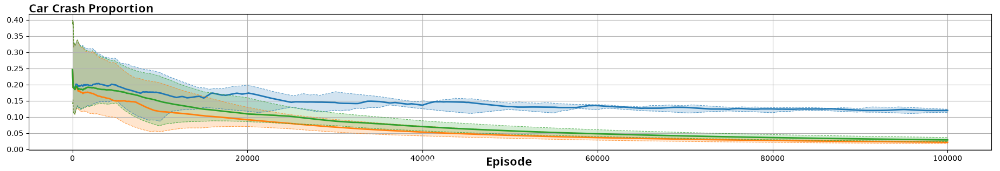
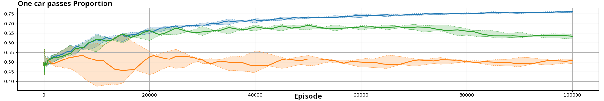

# Go-or-Yield experiment

The `marlkit.gooryield` experiment is a two-agent matrix game inspired by two cars approaching the same crossing. At every step, each agent chooses between **Go** and **Yield**. The joint action produces a collision, one car passing, or both cars stopping.

This README documents the implementation behind the generic MARLKIT launcher. The launcher menu discovers the six concrete classes in `marlkit.gooryield.launchers` from their runtime metadata and uses the headings below for documentation navigation.

## Quick start

From the repository root, build and launch the generic experiment menu:

```bash
./gradlew :MLK-experiments:run
```

Select **Go or Yield experiments**, choose a launcher, and press **Launch selected experiment**. Each simulation starts in a separate JVM, so the menu remains available for additional experiments.

Every concrete launcher also has a public `main(String[])` method and can be started directly from an IDE or the generated distribution.

## Available launchers

The package provides two groups of configurations. The scripted-opponent launchers evaluate one learning agent against an opponent whose policy changes over time. The remaining launchers run two agents using the same learning or opponent-modeling family.

### Scripted Opponent vs Independent Agent

`LauncherScriptedVsIndependent` evaluates a standard `AgentGoOrYield` against `AgentScripted`. The opponent switches policy every 5,000 episodes.

**Launcher:** `LauncherScriptedVsIndependent`

### Scripted Opponent vs Action-Frequency Agent

`LauncherScriptedVsFrequencyPrediction` evaluates an action-frequency opponent model. The learning agent uses the last 1,000 observed opponent actions to predict the next action.

**Launcher:** `LauncherScriptedVsFrequencyPrediction`

### Scripted Opponent vs Minimax Agent

`LauncherScriptedVsMiniMax` evaluates a conservative Minimax opponent model against the changing scripted opponent.

**Launcher:** `LauncherScriptedVsMiniMax`

### Two Independent Agents

`LauncherIndependent` launches two standard `AgentGoOrYield` instances. Neither agent models the other explicitly.

**Launcher:** `LauncherIndependent`

### Two Minimax Agents

`LauncherMiniMax` launches two `AgentGoOrYieldMinMax` instances using the Minimax model of the other agent.

**Launcher:** `LauncherMiniMax`

### Two Fictitious-Play Agents

`LauncherFictitiousPlay` launches two `AgentGoOrYieldFictitiousPlay` instances and gives each agent access to the other agents for fictitious-play prediction.

**Launcher:** `LauncherFictitiousPlay`

## Experiment architecture

The package follows the standard MARLKIT experiment composition:

| Component | Implementation | Responsibility |
|---|---|---|
| Environment | `environment.EnvGoOrYield` | Applies the two-action payoff matrix and emits matrix reward events. |
| Observation | `ObservationGoOrYield` | Provides the single observation shared by the matrix-game agents. |
| Actions | `agent.action.ActionGo`, `ActionYield` | Represent the two available decisions. |
| Learning agent | `agent.AgentGoOrYield` | Configures the independent Q-learning policy. |
| Scripted opponent | `agent.AgentScripted` | Cycles through fixed Go/Yield policies. |
| Opponent-model agents | `AgentGoOrYieldMinMax`, `AgentGoOrYieldActionFrequenciesPrediction`, `AgentGoOrYieldFictitiousPlay` | Add Minimax, action-frequency, or fictitious-play opponent modeling. |
| Scheduler | `SchedulerGoOrYield` | Defines the one-step episodes and 100,000-episode simulation. |
| Viewer | `ViewerGoOrYield` | Displays the proportions of the four joint-action outcomes. |
| Evaluator | `systemevaluator.GoOrYieldSystemEvaluator` | Records outcome proportions, reward, and recent Go frequencies. |

The main scripted-opponent comparison is:

```text
LauncherScriptedVsIndependent
LauncherScriptedVsFrequencyPrediction
LauncherScriptedVsMiniMax
```

The alternative launchers expose symmetric-agent configurations for direct experiments with the same environment.

## Environment dynamics

`EnvGoOrYield` is a single-state, two-agent environment. It expects exactly two agents and normalizes unexpected or missing actions to `Yield`.

Both agents act simultaneously. The resulting payoff matrix is:

| Agent 1 / Agent 2 | Go | Yield |
|---|---:|---:|
| Go | `(-10, -10)` | `(5, 0)` |
| Yield | `(0, 5)` | `(-2, -2)` |

The first value in each cell is the reward of Agent 1 and the second is the reward of Agent 2.

The four joint-action constants are:

| Outcome | Joint action | Evaluator measure |
|---|---|---|
| Yield-Yield | both agents choose `Yield` | `YieldYieldProportion` |
| Yield-Go | Agent 1 yields and Agent 2 goes | included in `YieldGoProportion` |
| Go-Yield | Agent 1 goes and Agent 2 yields | included in `YieldGoProportion` |
| Go-Go | both agents choose `Go` | `GoGoProportion` |

Each call to `dynamics` increments the corresponding outcome counter and returns one `MatrixRewardEvent` for each agent.

## Agents and learning

The standard `AgentGoOrYield` creates two actions, a value-based policy, and a Q-learning algorithm:

| Setting | Value |
|---|---|
| Action space | `ActionYield`, `ActionGo` |
| Policy | `QValueBasedPolicy` |
| Initial exploration parameter | `1.0` |
| Exploration strategy | `EpsilonGreedyExponentialDecay(1.0, 0.0001)` |
| Learning algorithm | `QLearning` |
| Learning rate | `0.2` |
| Discount factor | `0.95` |

The exploration parameter follows the exponential schedule:

$$
\epsilon_t = (1-d)^t
$$

where $d = 10^{-4}$ is the decay rate and $t$ is the number of learning steps.

The independent agent uses `QValueBasedPolicy`. JAL and fictitious-play variants extend this basic learning setup with information about the other agent's possible actions or observed behavior. The experiment does not use a communication module.

## Scripted opponent policies

`AgentScripted` cycles through five fixed stochastic policies. The policy changes every 5,000 episodes:

| Order | Policy | Probability of Go | Probability of Yield |
|---:|---|---:|---:|
| 1 | `AlwaysGoPolicy` | `1.00` | `0.00` |
| 2 | `Go75Yield25Policy` | `0.75` | `0.25` |
| 3 | `Go25Yield75Policy` | `0.25` | `0.75` |
| 4 | `AlwaysYieldPolicy` | `0.00` | `1.00` |
| 5 | `Go50Yield50Policy` | `0.50` | `0.50` |

The five-policy sequence spans 25,000 episodes and is repeated four times during the 100,000-episode simulation. The abrupt changes make it possible to compare adaptation speed and robustness across opponent models.

## Opponent-model configurations

### Independent configuration

The independent configuration uses `QValueBasedPolicy`. The learning agent estimates the value of its own actions without explicitly representing the opponent's action distribution.

This configuration is used by `LauncherScriptedVsIndependent` and `LauncherIndependent`.

### Action-frequency prediction

`AgentGoOrYieldActionFrequenciesPrediction` uses a JAL policy and predicts the opponent's next action from a window of the 1,000 most recent actions. The model adapts to a policy switch only after enough new observations enter the window.

This configuration is used by `LauncherScriptedVsFrequencyPrediction`.

### Minimax

`AgentGoOrYieldMinMax` uses a JAL policy and evaluates the worst-case opponent action. Its selected action maximizes the minimum expected return over the opponent's possible actions. This conservative strategy generally favors `Yield` when `Go` could produce a collision.

This configuration is used by `LauncherScriptedVsMiniMax` and `LauncherMiniMax`.

### Fictitious play

`AgentGoOrYieldFictitiousPlay` tracks the other agents and uses their observed behavior to form an opponent model. `LauncherFictitiousPlay` initializes both agents and gives each one access to the complete agent list before launch.

## Simulation lifecycle

`SchedulerGoOrYield` extends `MLKScheduler` and configures the following lifecycle:

1. Launch the single-state environment and two agents.
2. Compute the common Go-or-Yield observation.
3. Request one action from each agent.
4. Apply the joint action through the payoff matrix.
5. Emit matrix reward events and update outcome counters.
6. Convert events into rewards and build experiences.
7. Update the selected policies or opponent models.
8. End the one-step episode.
9. Update evaluation measures and continue until 100,000 episodes.

The scheduler parameters are:

| Parameter | Value |
|---|---:|
| Episode duration | `1` step |
| Maximum episodes | `100000` |
| Display start | immediately |
| Display interval | every episode |
| Displayed episodes | `1` |
| Display pause | `0` |

## Evaluation criteria

`GoOrYieldSystemEvaluator` records:

- **YieldGoProportion** — the proportion of episodes in which exactly one agent chooses `Go`.
- **GoGoProportion** — the proportion of collision episodes.
- **YieldYieldProportion** — the proportion of episodes in which both agents choose `Yield`.
- **TotalReward** — the sum of matrix rewards.
- **SelfGoProportion** — the recent Go frequency of the evaluated agent.
- **OpponentGoProportion** — the recent Go frequency of the opponent.

The evaluator keeps the recent self/opponent action windows bounded while accumulating the episode outcome proportions.

## Results

The figures summarize runs with ten random seeds. Curves show the median across runs, and shaded areas represent the first-to-third quartile range. Curves are smoothed with a moving-average window of 100 episodes.

The figure colors are:

- green: independent learning;
- orange: Minimax;
- blue: action-frequency prediction.

### Collision rate



Minimax generally produces the lowest collision rate because its worst-case assumption favors `Yield`. Action-frequency prediction can temporarily produce more collisions after an abrupt opponent-policy switch while its history window adapts.

### One car passing



Action-frequency prediction can increase the proportion of episodes in which exactly one car goes, because the learning agent can exploit an opponent that frequently yields.

### Both cars stopping


Minimax tends to produce more Yield-Yield episodes because its conservative action selection avoids the collision payoff.

## Adding a new launcher

To add another Go-or-Yield configuration:

1. Create a concrete `MLKLauncher` subclass in `marlkit.gooryield.launchers`.
2. Configure `SchedulerGoOrYield`, `EnvGoOrYield`, `MLKModel`, and `ViewerGoOrYield` with `@EngineAgents`.
3. Add a public static `main(String[] args)` method.
4. Add runtime `@LauncherMetadata` with a unique title and README heading anchor.
5. Add a matching `###` section to this README.
6. Run the launcher catalog and resource packaging tests.

Example metadata:

```java
@LauncherMetadata(
    title = "My Go-or-Yield Variant",
    documentationAnchor = "my-go-or-yield-variant")
```

No manual catalog or menu list needs to be updated: the generic catalog discovers annotated concrete launchers automatically.

## Source files and resources

- Source README: `src/main/java/marlkit/gooryield/README.md`
- Runtime README: `/marlkit/gooryield/README.md`
- Launcher package: `marlkit.gooryield.launchers`
- Environment: `marlkit.gooryield.environment.EnvGoOrYield`
- Agents: `marlkit.gooryield.agent`
- Scheduler: `marlkit.gooryield.SchedulerGoOrYield`
- Viewer: `marlkit.gooryield.ViewerGoOrYield`
- Evaluator: `marlkit.gooryield.systemevaluator.GoOrYieldSystemEvaluator`
- Figures: `src/main/resources/marlkit/gooryield/figures/`
