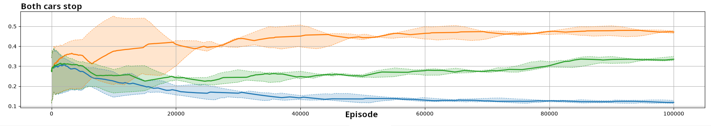

# Go or Yield experiment

## Intro

Go or Yield is a two-agent experiment in which both agents represent cars that repeatedly choose between two actions: *Go* and *Yield*. Each episode consists of a single timestep during which both agents select an action. The resulting joint action leads to one of three possible outcomes: a collision, one car passing, or both cars stopping.

This experiment compares three modes for modeling the other agent while keeping the environment, reward model, learning algorithm, communication configuration, and other core modules unchanged:

- Independent, without a model of the opponent;
- JAL-AM with action-frequency modeling;
- JAL-GT with Minimax.

One agent is evaluated as the learning agent, while the other follows a sequence of preconfigured policies and serves as its opponent.

## Environment dynamics

The environment contains two agents representing cars. At each episode, both agents simultaneously select either *Go* or *Yield*:

- if both agents select *Go*, they collide;
- if one agent selects *Go* and the other selects *Yield*, one car passes;
- if both agents select *Yield*, both cars stop.

Each episode lasts exactly one timestep.

The environment dynamics are implemented by `EnvGoOrYield`.

## Simulation loop (scheduler)

`SchedulerGoOrYield` coordinates the simulation using the base flow provided by `MLKScheduler`. It triggers observation, action selection, environment reaction, experience collection, model updates, and policy updates at the appropriate times.

Each episode consists of one timestep, and the complete simulation lasts for $100\,000$ episodes. Every $5\,000$ episodes, the opponent switches to another preconfigured policy.

## Reward model

The experiment uses `MixedReward`, the independent reward model. Each agent receives the default reward associated with the joint action selected during the episode.

The possible joint actions and their associated default rewards $\rho$ are defined by the following reward matrix:

| Agent 1 \ Agent 2 | Go         | Yield      |
|-------------------|------------|------------|
| Go                | (-10, -10) | (5, 0)     |
| Yield             | (0, 5)     | (-2, -2)   |

In each cell of the matrix, the reward on the left is received by Agent 1, and the reward on the right is received by Agent 2.

## Learning module

The evaluated agent uses `QLearning`, a value-based learning algorithm based on a Q-table. The learning rate $\alpha$ is set to $0.2$, and the discount factor $\gamma$ is set to $0.95$.

The policy follows an epsilon-greedy exploration strategy, with:

$$
\epsilon = (1-d)^t,
$$

where $d$ is the decay rate, set to $10^{-4}$, and $t$ is the number of episodes.

The policy implementation depends on the tested MOA configuration:

- `QValueBasedPolicy` evaluates only the learning agent's own actions and is used by the independent configuration;
- `QValueBasedJALPolicy` evaluates joint actions and uses the MOA module to account for the opponent's possible actions.

Training and execution are decentralized, and no communication mechanism is used.

## Opponent policies

The opponent is preconfigured with five policies, which are used sequentially. Each policy defines fixed probabilities of selecting *Go* and *Yield*.

The sequence of the policies follow this order:

1. `AlwaysGoPolicy`: selects *Go* with probability $1$ and *Yield* with probability $0$;
2. `Go75Yield25Policy`: selects *Go* with probability $0.75$ and *Yield* with probability $0.25$;
3. `Go25Yield75Policy`: selects *Go* with probability $0.25$ and *Yield* with probability $0.75$;
4. `AlwaysYieldPolicy`: selects *Go* with probability $0$ and *Yield* with probability $1$;
5. `Go50Yield50Policy`: selects *Go* and *Yield* with probability $0.5$ each.

The opponent switches to the next policy every $5\,000$ episodes. This setup introduces abrupt changes in its behavior and makes it possible to evaluate how quickly the learning agent adapts.

The complete sequence covers $25\,000$ episodes and is repeated four times during the $100\,000$-episode simulation.

## MOA configurations

Three configurations are evaluated. They differ only in the policy and MOA implementation used by the learning agent.

### Independent

The independent agent does not model the opponent. It uses `QValueBasedPolicy`, which associates expected returns with the learning agent's own actions without explicitly considering the opponent's actions.

`LauncherScriptedVsIndependent` runs this configuration.

### JAL-AM with Action Frequencies

The JAL-AM agent evaluates joint actions using `QValueBasedJALPolicy`. It predicts the opponent's next action from the frequencies of the opponent's $1\,000$ most recent actions.

The resulting action-frequency model allows the agent to adapt to the opponent's observed behavior. Because the model is based on a history of recent actions, adaptation is not immediate when the opponent abruptly changes its policy.

`NActionFrequenciesDeterministicPredictionAction` implements the opponent model.

`LauncherScriptedVsFrequencyPrediction` runs this configuration.

### JAL-GT with Minimax

The JAL-GT agent also evaluates joint actions using `QValueBasedJALPolicy`. Its Minimax model assumes that the opponent selects the worst-case action for the learning agent. The selected action therefore maximizes the minimum expected return over the opponent's possible actions.

This conservative strategy tends to favor *Yield* when selecting *Go* could result in a collision.

`MinimaxValueFunctionPredictAction` implements this opponent model.

`LauncherScriptedVsMiniMax` runs this configuration.

## Launchers and how to run

Three launchers instantiate the same environment, scenario, reward model, learning algorithm, and communication configuration. They differ only in the policy and MOA configuration used by the evaluated agent:

- `LauncherScriptedVsIndependent` uses `QValueBasedPolicy` without an opponent model;
- `LauncherScriptedVsFrequencyPrediction` uses `QValueBasedJALPolicy` with action-frequency modeling;
- `LauncherScriptedVsMiniMax` uses `QValueBasedJALPolicy` with Minimax.

Each concrete launcher provides a `main` method and can be run directly from the IDE.

## Evaluation criteria

The evaluation criteria measure the proportion of episodes associated with each possible outcome:

- **Collision**: both agents select *Go*;
- **One car passing**: one agent selects *Go* while the other selects *Yield*;
- **Both cars stopping**: both agents select *Yield*.

## Results

All experiments were run with ten different seeds. The curves represent the median across all runs, while the colored areas indicate the range between the first and third quartiles. The data are smoothed using a moving average with a window size of $100$.

The colors used in the figures are:

- green: independent;
- orange: Minimax;
- blue: action-frequency modeling.

### Collision rate

Minimax tends to produce the lowest collision rate because it assumes the opponent will select the worst-case action and consequently favors *Yield*. Action-frequency modeling can temporarily produce more collisions after an abrupt change in the opponent's policy because its model requires time to adapt to the new action distribution.

### One car passing

Action-frequency modeling maximizes the proportion of episodes in which one agent selects *Go* and the other selects *Yield*. By predicting the opponent's actions from recent observations, the learning agent can exploit opponent policies that frequently select *Yield*.

### Both cars stopping

Minimax tends to produce more episodes in which both cars stop because its conservative worst-case assumption encourages the evaluated agent to select *Yield*.

## Summary

The three modeling modes lead to substantially different learning dynamics and outcomes.

Minimax follows a conservative strategy. By assuming the worst-case action from the opponent, it tends to select *Yield* and avoid collisions, but it can also increase the number of episodes in which both cars stop.

Action-frequency modeling adapts to the opponent's recent behavior and maximizes the proportion of episodes in which one car passes. However, abrupt changes in the opponent's policy temporarily increase the collision rate because the model needs new observations before its action frequencies reflect the changed behavior.

The independent configuration does not explicitly account for the opponent's behavior and exhibits intermediate behavior between the two MOA-based configurations.

