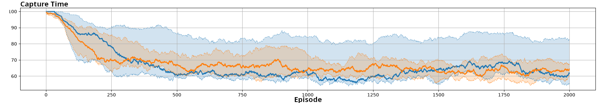
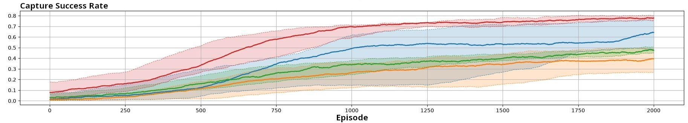

# PreyHunter experiment

## Intro

PreyHunter is a cooperative experiment in which two hunter agents must jointly capture a non-learning prey. The prey moves randomly, and a capture occurs only when both hunters are sufficiently close to it. Each hunter's action is a continuous two-dimensional movement vector generated by its policy. Hunters have a limited viewing range. 

This package already provide two groups of experiments:

- a comparison of decentralized and centralized training using DDPG and MADDPG;
- a comparison of four communication configurations using PPO.

Within each group, the compared configurations use the same environment, scenario, reward model, and evaluation criteria. Only the module being evaluated is changed.

## Environment dynamics

The environment contains one prey and two hunters. The prey follows a random, non-learning policy. At each timestep, the hunters select movement actions.

The prey is caught when both hunters are within the required capture range. An episode ends when either:

- the hunters catch the prey; or
- 100 timesteps have passed without a capture.

Each hunter has a limited observation range. Consequently, a hunter may be unable to observe the prey when it is too far away. This partial observability makes information sharing potentially useful in the communication experiments.

The environment dynamics are implemented by `EnvPreyVsHunter`.

## Simulation loop (scheduler)

`SchedulerPVH` coordinates the simulation using the base flow provided by `MLKScheduler`. It triggers observation, action selection, communication when enabled, environment reactions, experience collection, model updates, and policy updates at the appropriate times.

The scheduler also defines the stopping conditions and timing rules. In the experiments presented here, an episode lasts at most 100 timesteps and terminates earlier when the prey is caught.

## Reward model

All PreyHunter experiments use `MixedReward`, the independent reward model. For each agent, the final reward is equal to the sum of the default rewards associated with the events experienced by that agent.

Let $E_i$ be the set of events associated with agent $i$ during a timestep and let $\rho(e)$ be the default reward associated with event $e$. The final reward is:

$$
r_i = \sum_{e \in E_i} \rho(e).
$$

### Default event reward values

The possible events and their associated default rewards are:

- *Prey Caught*: This event is associated with an agent when the prey is caught. Its default reward is:

$$
\rho(e_{\text{prey\_caught}}) = 300.
$$

- *Distance*: This event is associated with an agent according to its distance from the prey. When the agent is close to the prey, the corresponding default reward satisfies:
$$
\rho(e_{\text{distance}}) =
\begin{cases}
((1 - d/d_0) \cdot r_c) & \text{if } d < d_0 \\
r_p \cdot (d-d_0) & \text{otherwise}
\end{cases}
$$

where $d$ is the distance between the agent and the prey, $d_0$ is the distance threshold at which the hunter is consider close enough to receive a positive feedback signal (default: $2$), $r_c$ is the positive reward scaling factor (default: $2$) and $r_p$ is the distance penalty factor, which is negative (default: $-0.5$).

## Evaluation criteria

The same three metrics are used in all experiments:

- **Total raw reward**: the sum of the raw rewards received by both hunters. This metric reflects the overall performance of the hunter team.
- **Capture success rate**: the proportion of episodes in which the prey is caught.
- **Capture time**: the number of timesteps required to catch the prey. This value is set to 100 when the prey is not caught.

## Training and execution mode experiment

This experiment compares two actor-critic algorithms that use different training configurations while keeping the other core modules identical.

### DDPG

`DDPG` is a Deep Deterministic Policy Gradient implementation designed for continuous action spaces. It learns a deterministic policy and trains an actor and a critic from experiences sampled from a replay buffer.

In this configuration, training and execution are completely decentralized (DTE). Each hunter has its own policy, critic, learning algorithm, and replay buffer. Agents do not use models of the other agent's policy, and no information is exchanged through the communication module.

The policy is implemented by `MLPDeterministicPolicy`.

The actor network has two hidden layers of $64$ neurons each, while the critic network has one hidden layer of $64$ neurons. The actor and critic learning rates are set to $10^{-4}$ and $10^{-3}$, respectively.

The discount factor $\gamma$ is set to $0.99$, and the target-network update coefficient $\tau$ is set to $0.005$. Training uses batches of $64$ experiences sampled from a replay buffer with a capacity of $100\,000$ experiences.

Exploration is performed by adding Gaussian noise to the action vector produced by the actor. The standard deviation of the Gaussian noise is set to $0.4$.

### MADDPG

`MADDPG` is a variation of DDPG based on centralized critics. During training, a critic uses information concerning the other agents in addition to the local agent's information. The agents therefore build models of the other agents' policies and use them to predict their actions when training the critic.

DDPG and MADDPG use the same hyperparameters.

Execution remains decentralized because each actor selects its action from locally available information. No explicit messages are exchanged between agents through the communication module.

As with DDPG, the actor policy is implemented by `MLPDeterministicPolicy`.

### Communication configuration

The communication module is set to no communication for both DDPG and MADDPG. The difference between these configurations concerns the information used during training, not message exchange between agents during the simulation.

### Launchers and how to run

Two launchers instantiate the same environment, scenario, reward model, and communication module. They differ in their learning algorithm and training configuration:

- `LauncherPVHDDPG` uses `DDPG` with decentralized training and decentralized execution;
- `LauncherPVHMADDPG` uses `MADDPG` with centralized critics and decentralized execution.

Each concrete launcher provides a `main` method and can be run directly from the IDE.

### Results

All experiments were run with ten different seeds. The curves represent the median across all runs, while the colored areas indicate the range between the first and third quartiles. The data are smoothed using a moving average with a window size of 100.

Blue represents DDPG, and orange represents MADDPG.

#### Total raw reward

DDPG and MADDPG reach similar median total rewards. However, the MADDPG results are less dispersed across runs, as indicated by the smaller distance between the first and third quartiles.

#### Capture success rate

The two algorithms produce similar median capture success rates. MADDPG nevertheless produces more consistent results across seeds.

#### Capture time

The two algorithms also obtain similar median capture times. As for the other evaluation criteria, the MADDPG results show lower dispersion.

### Summary

In this experiment, changing the training configuration does not substantially change median performance. DDPG and MADDPG achieve similar results according to all three evaluation criteria. The main observed difference is that MADDPG produces more consistent outcomes across runs.

## Communication experiment

This experiment compares four communication configurations while keeping the environment, scenario, reward model, training mode, policy, and learning algorithm identical.

### Learning module

The learning algorithm is `PPOCategorical`, an implementation of Proximal Policy Optimization (PPO). PPO updates the policy by increasing the probability of successful actions and decreasing the probability of unsuccessful ones. Its clipped objective limits the magnitude of each policy update to improve learning stability.

The clipping parameter $\epsilon$ is set to $0.2$, the learning rate is set to $0.001$, and the discount factor $\gamma$ is set to $0.95$. The policy is updated over four epochs at each learning step.

The policy is implemented by `NeuralNetworkCategoricalPolicy`. Its neural network contains two hidden layers with 32 neurons each and produces a categorical probability distribution over the possible actions. Actions are selected using a softmax function with a temperature parameter set to $1.0$.

Training and execution are completely decentralized (DTE), and agents do not build or use models of other agents.

### Communication modes

Four communication modes are evaluated:

#### No communication

The agents do not exchange messages. Each hunter selects its action using only its own observation and policy.

#### Observation sharing

The agents broadcast their observations to the other agents. Each hunter enriches its own observation with the observations received from the other agent before selecting an action.

Each observation is represented by an `ObservationPositionsValues`, which contains a list of `ObservationPositionValue` objects. Each `ObservationPositionValue` consists of a position stored as a `Tuple` and an associated value (`double`). An observation records the relative position of a prey when it is within the agent's field of view; otherwise, the observation remains empty.

Information sharing is handled through the `BroadcastRelativeObservationPositions` communication model. Each agent broadcasts its own `ObservationPositionsValues` to all other agents and then updates its observations using the received information. As a result, an agent that cannot directly see the prey can still acquire its relative position if another agent currently has the prey within its view range. The point of view associated with this relative position is updated accordingly.

#### Policy parameter sharing

The agents broadcast their policy parameters. Each agent averages its own parameters with those received from the other agent and subsequently uses the averaged parameters.

`BroadcastAveragedPolicyParameters` is the communication model used in this approach. The policy parameters correspond to the neural network weights. Agents exchange their parameters and update their local policy using the averaged weights.

#### Observation and policy parameter sharing

This mode combines observation sharing and policy parameter sharing. Agents enrich their observations using received observations and periodically average their policy parameters.

### Launchers and how to run

Four launchers instantiate the same environment, scenario, reward model, policy, and learning algorithm. They differ only in their communication module:

- `LauncherPVHPPO` uses no communication;
- `LauncherPVHPPOBroadcastObservation` uses observation sharing;
- `LauncherPVHPPOAveragedPolicyParameters` uses policy parameter sharing;
- `LauncherPVHPPOBroadcastObservationAndAveragedParameters` uses both observation and policy parameter sharing.

Each concrete launcher provides a `main` method and can be run directly from the IDE.

### Results

All experiments were run with ten different seeds. The curves represent the median across all runs, while the colored areas indicate the range between the first and third quartiles. The data are smoothed using a moving average with a window size of 500.

The colors used in the figures are:

- orange: no communication;
- green: policy parameter sharing;
- blue: observation sharing;
- red: observation and policy parameter sharing.

#### Total raw reward

Observation sharing leads to higher rewards because it increases the likelihood that the hunters have enough information to coordinate. With well-trained policies, only one hunter needs to locate the prey for both hunters to coordinate and capture it.

Policy parameter sharing also improves performance by propagating policy improvements between agents. Combining observation sharing and parameter sharing allows the agents to benefit from both mechanisms.

#### Capture success rate

Even with a well-trained policy, the hunters may fail to catch the prey because both must be sufficiently close to it, while their individual observation ranges are limited. Observation sharing increases the capture success rate by allowing information discovered by one hunter to be used by the other.

#### Capture time

Communication generally reduces the time required to catch the prey. Observation sharing facilitates coordination after either hunter locates the prey, while policy parameter sharing facilitates and stabilizes learning.

### Summary

Observation sharing improves performance because it reduces the consequences of partial observability. Once one hunter locates the prey, the shared observation can help both hunters coordinate their movements.

Policy parameter sharing also facilitates learning. When one agent improves its policy, this improvement is propagated to the other agent by parameter averaging. In this experiment, parameter sharing improves median performance and produces more consistent results across runs.
