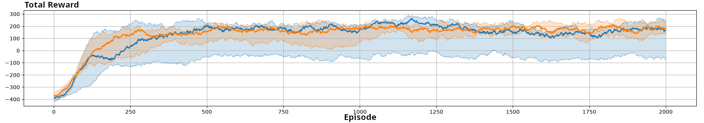
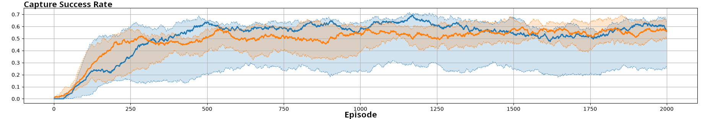
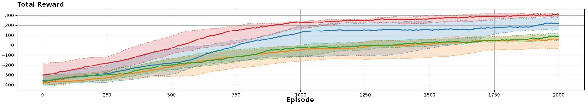
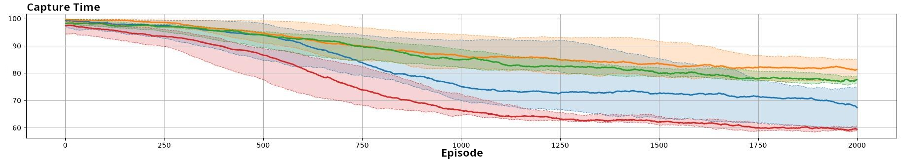

# PreyHunter experiment

The `marlkit.preyhunter` experiment studies cooperative pursuit in a continuous two-dimensional environment. Two learning hunters must capture one randomly moving prey. A capture succeeds only when both hunters are sufficiently close to the prey at the same time.

This README documents the implementation behind the generic MARLKIT launcher. The launcher menu discovers the eight concrete classes in `marlkit.preyhunter.launchers` from their runtime metadata and uses the headings below for documentation navigation.

## Quick start

From the repository root, build and launch the generic experiment menu:

```bash
./gradlew :MLK-experiments:run
```

Select **PreyHunter experiments**, choose a launcher, and press **Launch selected experiment**. Each simulation starts in a separate JVM, so the menu remains available for additional launches.

Every concrete launcher also has a public `main(String[])` method and can be started directly from an IDE or from the generated distribution.

## Available launchers

The launchers share the same environment, prey, reward model, and evaluation criteria. They vary the learning algorithm, centralized-critic training, and communication mechanism.

### PPO No Communication

`LauncherPVHPPO` uses PPO hunters without explicit communication. Each hunter acts from its local observation and policy.

**Launcher:** `LauncherPVHPPO`

### DDPG Decentralized Training

`LauncherPVHDDPG` uses DDPG with decentralized training and decentralized execution. Each hunter has its own actor, critic, replay buffer, and policy.

**Launcher:** `LauncherPVHDDPG`

### MADDPG Centralized Critic

`LauncherPVHMADDPG` uses MADDPG. Actors execute from local information, while centralized critics use information about the other hunters during training.

**Launcher:** `LauncherPVHMADDPG`

### PPO Broadcast Observation

`LauncherPVHPPOBroadcastObservation` uses PPO and broadcasts relative prey observations between hunters.

**Launcher:** `LauncherPVHPPOBroadcastObservation`

### PPO Averaged Policy Parameters

`LauncherPVHPPOAveragedPolicyParameters` uses PPO and averages neural-network policy parameters received from the other hunters.

**Launcher:** `LauncherPVHPPOAveragedPolicyParameters`

### DDPG Broadcast Observation

`LauncherPVHDDPGBroadcastObservation` combines DDPG with broadcast relative-observation communication.

**Launcher:** `LauncherPVHDDPGBroadcastObservation`

### MADDPG Broadcast Observation

`LauncherPVHMADDPGBroadcastObservation` combines MADDPG centralized critics with broadcast relative observations.

**Launcher:** `LauncherPVHMADDPGBroadcastObservation`

### PPO Broadcast Observation and Averaged Parameters

`LauncherPVHPPOBroadcastObservationAndAveragedParameters` combines both PPO communication mechanisms: observation sharing and policy-parameter averaging.

**Launcher:** `LauncherPVHPPOBroadcastObservationAndAveragedParameters`

## Experiment architecture

The package follows the standard MARLKIT experiment composition:

| Component | Implementation | Responsibility |
|---|---|---|
| Launcher base | `launchers.LauncherPVH` | Defines shared dimensions, reward model, agent counts, and environment creation. |
| Environment | `environment.EnvPreyVsHunter` | Moves hunters and prey, computes observations, and emits pursuit events. |
| Hunters | `agent.HunterAgent*` | Learn continuous movement policies using PPO, DDPG, or MADDPG variants. |
| Prey | `agent.PreyAgent` | Moves randomly and does not learn. |
| Scheduler | `scheduler.SchedulerPVH` | Defines episode duration, evaluation, display, and simulation limits. |
| Centralized scheduler | `scheduler.SchedulerPVHCentralizedCritic` | Provides the centralized-critic activation flow for MADDPG. |
| Viewer | `viewer.ViewerPVH` | Displays the continuous environment and agent trajectories. |
| Evaluator | `systemevaluator.PreyHunterSystemEvaluator` | Records reward, capture success, and capture time. |

The launcher families are:

```text
LauncherPVH
├── PPO variants
│   ├── LauncherPVHPPO
│   ├── LauncherPVHPPOBroadcastObservation
│   ├── LauncherPVHPPOAveragedPolicyParameters
│   └── LauncherPVHPPOBroadcastObservationAndAveragedParameters
├── DDPG variants
│   ├── LauncherPVHDDPG
│   └── LauncherPVHDDPGBroadcastObservation
└── MADDPG variants
    ├── LauncherPVHMADDPG
    └── LauncherPVHMADDPGBroadcastObservation
```

## Environment and agents

`LauncherPVH` creates an `EnvPreyVsHunter` with the following shared configuration:

| Parameter | Value |
|---|---:|
| Environment width | `10` |
| Environment height | `10` |
| Hunters | `2` |
| Preys | `1` |
| Capture radius | `1.2` |
| Hunters required for capture | `2` |
| Hunter view range | `5.0` |
| Prey view range | `0.0` |
| Hunter speed | `0.2` |
| Prey speed | `0.15` |
| Hunter movement directions | `4` |

The prey moves randomly. Hunters can observe other hunters, but the prey is only observable when it is within the hunter's view range. This partial observability is the motivation for the communication variants.

The environment emits events for prey capture and hunter/prey or hunter/hunter distances. The selected reward model converts these events into learning rewards.

## Reward model

All current launchers use `MixedReward`. For agent $i$, let $E_i$ be the events produced during one step and let $\rho(e)$ be an event's default reward:

$$
r_i = \sum_{e \in E_i} \rho(e)
$$

The important default event values are:

| Event | Default reward or rule |
|---|---|
| `PreyCatchEvent` | `300` |
| `HunterPreyDistanceEvent` with distance $d < d_0$ | $(1-d/d_0)r_c$ |
| `HunterPreyDistanceEvent` with distance $d \ge d_0$ | $r_p(d-d_0)$ |

The current environment parameters are $d_0 = 2$, $r_c = 2$, and $r_p = -0.5$. Thus, hunters receive positive feedback when close to the prey and a distance penalty when they are farther away.

A future launcher can select another `RewardModel` in `LauncherPVH` without changing the generic menu contract.

## Training configurations

### DDPG Decentralized Training

`LauncherPVHDDPG` creates one DDPG hunter per agent. Each hunter has its own deterministic actor, critic, learning algorithm, replay buffer, and policy. Training and execution are decentralized, and no messages are exchanged.

The actor uses `MLPDeterministicPolicy` with two hidden layers of 64 neurons. The critic has one hidden layer of 64 neurons. The main hyperparameters are:

| Parameter | Value |
|---|---:|
| Actor learning rate | $10^{-4}$ |
| Critic learning rate | $10^{-3}$ |
| Discount factor $\gamma$ | `0.99` |
| Target update coefficient $\tau$ | `0.005` |
| Replay-buffer capacity | `100000` |
| Batch size | `64` |
| Gaussian exploration standard deviation | `0.4` |

### MADDPG Centralized Critic

`LauncherPVHMADDPG` keeps decentralized actors but gives the critics information about the other hunters during training. The agents are configured with each other so the centralized-critic activator can construct the required joint inputs.

MADDPG uses the same actor, critic, optimizer, replay-buffer, and exploration hyperparameters as DDPG. The difference is the information available to the critic during learning.

### Communication configuration

The DDPG and MADDPG base launchers do not exchange explicit messages. MADDPG's centralized information is a training mechanism, not runtime communication between the actors.

## PPO and communication configurations

The PPO launchers use `PPOCategorical` and `NeuralNetworkCategoricalPolicy`. The policy network has two hidden layers of 32 neurons and outputs a categorical distribution over movement actions.

| PPO parameter | Value |
|---|---:|
| Clipping parameter $\epsilon$ | `0.2` |
| Learning rate | `0.001` |
| Discount factor $\gamma$ | `0.95` |
| Policy update epochs | `4` |
| Softmax temperature | `1.0` |

### PPO No Communication

`LauncherPVHPPO` is the baseline. Each hunter selects actions using its own observation and policy, without exchanging observations or parameters.

### PPO Broadcast Observation

`LauncherPVHPPOBroadcastObservation` uses `BroadcastRelativeObservationPositions`. A hunter that sees the prey can broadcast its relative position, allowing another hunter to use information that is outside its own view range.

### PPO Averaged Policy Parameters

`LauncherPVHPPOAveragedPolicyParameters` uses `BroadcastAveragedPolicyParameters` with received-parameter weight `0.5`. Hunters exchange neural-network parameters and update their local policy using the averaged values.

### PPO Broadcast Observation and Averaged Parameters

`LauncherPVHPPOBroadcastObservationAndAveragedParameters` combines both communication modes. Hunters share relative observations and average their policy parameters.

## Simulation lifecycle

`SchedulerPVH` extends `MLKScheduler` and configures the following lifecycle:

1. Launch the environment, two hunters, and one random prey.
2. Initialize the continuous state and agents.
3. Compute partial observations for the hunters.
4. Execute communication when enabled.
5. Select continuous movement actions.
6. Move the hunters and prey and generate pursuit events.
7. Convert events into mixed rewards.
8. Build and collect experiences.
9. Update PPO, DDPG, or MADDPG policies and critics.
10. End the episode when the prey is captured or after 100 steps.
11. Record evaluation measures and continue until the simulation limit.

The scheduler configuration is:

| Parameter | Value |
|---|---:|
| Episode duration | `100` steps |
| Maximum episodes | `20000` |
| Display start | immediately |
| Display interval | `5000` episodes |
| Displayed episodes | `1` |
| Display pause | `100` |

## Evaluation criteria

`PreyHunterSystemEvaluator` records:

- **Total raw reward** — the sum of raw rewards received by both hunters.
- **Capture success rate** — the proportion of episodes in which the prey is captured.
- **Capture time** — the number of steps needed to capture the prey, or `100` when capture does not occur.

All launchers use the same evaluation criteria so that training, communication, and algorithm variants can be compared directly.

## Results

The figures summarize runs with ten random seeds. Curves show the median, and shaded areas represent the first-to-third quartile range. The data are smoothed with a moving-average window.

### DDPG and MADDPG total raw reward



The decentralized and centralized-critic variants reach similar median rewards, while centralized critics generally reduce variation between runs.

### DDPG and MADDPG capture success rate



Capture success compares how often both hunters reach the prey within the required capture radius.

### DDPG and MADDPG capture time


Lower capture time indicates faster coordination and pursuit.

### Communication total reward



Observation sharing and parameter sharing can improve coordination under partial observability.

### Communication capture success rate


Sharing the prey location found by one hunter can improve the probability that both hunters reach the prey.

### Communication capture time



Communication can reduce the time needed to coordinate a successful capture.

## Adding a new launcher

To add another PreyHunter configuration:

1. Create a concrete `MLKLauncher` subclass in `marlkit.preyhunter.launchers`.
2. Configure the appropriate scheduler, model, viewer, environment, and agents with `@EngineAgents`.
3. Add a public static `main(String[] args)` method.
4. Add runtime `@LauncherMetadata` with a unique title and README heading anchor.
5. Add a matching `###` section to this README.
6. Run the launcher catalog and resource packaging tests.

Example metadata:

```java
@LauncherMetadata(
    title = "My PreyHunter Variant",
    documentationAnchor = "my-preyhunter-variant")
```

No manual catalog or menu list needs to be updated: the generic catalog discovers annotated concrete launchers automatically.

## Source files and resources

- Source README: `src/main/java/marlkit/preyhunter/README.md`
- Runtime README: `/marlkit/preyhunter/README.md`
- Launcher package: `marlkit.preyhunter.launchers`
- Environment: `marlkit.preyhunter.environment.EnvPreyVsHunter`
- Agents: `marlkit.preyhunter.agent`
- Scheduler: `marlkit.preyhunter.scheduler.SchedulerPVH`
- Viewer: `marlkit.preyhunter.viewer.ViewerPVH`
- Evaluator: `marlkit.preyhunter.systemevaluator.PreyHunterSystemEvaluator`
- Figures: `src/main/resources/marlkit/preyhunter/figures/`
